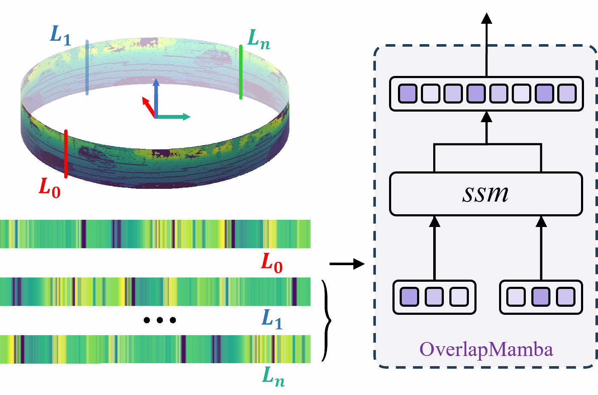

# OverlapMamba: Novel Shift State Space Model for LiDAR-based Place Recognition


<p align="center">

</p>
<b><p align="center" style="margin-top: -20px;">
Video demo
</b></p>

### 💾Environment


We use pytorch-gpu for neural networks.

To use a GPU, first you need to install the nvidia driver and CUDA.

- CUDA Installation guide: [link](https://docs.nvidia.com/cuda/cuda-installation-guide-linux/index.html)  
  We use CUDA 11.3 in our work. Other versions of CUDA are also supported but you should choose the corresponding torch version in the following Torch dependences.  

- System dependencies:

  ```bash
  sudo apt-get update 
  sudo apt-get install -y python3-pip python3-tk
  sudo -H pip3 install --upgrade pip
  ```
- Torch dependences:  
  Following this [link](https://pytorch.org/get-started/locally/), you can download Torch dependences by pip:
  ```bash
  pip3 install torch==1.10.2+cu113 torchvision==0.11.3+cu113 torchaudio==0.10.2+cu113 -f https://download.pytorch.org/whl/cu113/torch_stable.html
  ```
  or by conda:
  ```bash
  conda install pytorch torchvision torchaudio cudatoolkit=11.3 -c pytorch
  ```
  
- Other Python dependencies (may also work with different versions than mentioned in the requirements file):

  ```bash
  sudo -H pip3 install -r requirements.txt
  ```

## 📖How to use

We provide a training and test tutorial for KITTI sequences in this repository. Before any operation, please modify the [config file](https://github.com/SCNU-RISLAB/OverlapMamba/blob/main/OverlapMamba/config/config.yml) according to your setups.

### 📚Dataset 

Download KITTI dataset from [KITTI](https://www.cvlibs.net/datasets/kitti/user_login.php).

We recommend you follow our code and data structures as follows.

### Code Structure

```bash
├── config
│   ├── config_nclt.yml
│   └── config.yml
├── modules
│   ├── loss.py
│   ├── netvlad.py
│   ├── overlap_mamba_nclt.py
│   └── overlap_mamba.py
├── test
│   ├── test_mamba_topn_prepare.py
│   ├── test_mamba_topn.py
│   ├── test_kitti00_prepare.py
│   ├── test_kitti00_PR.py
│   ├── test_kitti00_topN.py
│   ├── test_results_nclt
│   │   └── predicted_des_L2_dis_bet_traj_forward.npz (to be generated)
│   └── test_results_kitti
│       └── predicted_des_L2_dis.npz (to be generated)
├── tools
│   ├── read_all_sets.py
│   ├── read_samples_haomo.py
│   ├── read_samples.py
│   └── utils
│       ├── gen_depth_data.py
│       ├── split_train_val.py
│       └── utils.py
├── train
│   ├── training_overlap_mamba_nclt.py
│   └── training_overlap_mamba_kitti.py
├── valid
│   └── valid_seq.py
├── visualize
│   ├── des_list.npy
│   └── viz_nclt.py
└── weights
    ├── pretrained_overlap_mamba_nclt.pth.tar
    └── pretrained_overlap_mamba.pth.tar
```

### Dataset Structure
```
  data_root_folder (KITTI sequences root) follows:
  ├── 00
  │   ├── depth_map
  │     ├── 000000.png
  │     ├── 000001.png
  │     ├── 000002.png
  │     ├── ...
  │   └── overlaps
  │     ├── train_set.npz
  ├── 01
  ├── 02
  ├── ...
  ├── 10
  └── loop_gt_seq00_0.3overlap_inactive.npz
  
  valid_scan_folder (KITTI sequence 02 velodyne) contains:
  ├── 000000.bin
  ├── 000001.bin
  ...

  gt_valid_folder (KITTI sequence 02 computed overlaps) contains:
  ├── 02
  │   ├── overlap_0.npy
  │   ├── overlap_10.npy
  ...
```
You need to download or generate the following files and put them in the right positions of the structure above:
- You can find the groud truth for KITTI 00  here: [loop_gt_seq00_0.3overlap_inactive.npz](https://drive.google.com/file/d/1upAwJBF-_UIB7R8evW0PuJBM3RnrTbzl/view?usp=sharing)
- You can find `gt_valid_folder` for sequence 02 [here](https://drive.google.com/file/d/13_1j20Uq3ppjVEkYaYcKjiJ2Zm7tudyH/view?usp=sharing).   
- Since the whole KITTI sequences need a large memory, we recommend you generate range images such as `00/depth_map/000000.png` by the preprocessing from [Overlap_Localization](https://github.com/PRBonn/overlap_localization/blob/master/src/prepare_training/gen_depth_and_normal_map.py), and we will not provide these images. 
- More directly, you can generate `.png` range images by [this script](https://github.com/SCNU-RISLAB/OverlapMamba/blob/main/OverlapMamba/tools/utils/gen_depth_data.py) .
- `overlaps` folder of each sequence below `data_root_folder` is provided by the authors of OverlapNet [here](https://drive.google.com/file/d/1i333NUC1DnJglXasqkGYCmo9p45Fx28-/view?usp=sharing). You should rename them to `train_set.npz`.


### Quick Use

For a quick use, you could download our [model pretrained on KITTI](https://github.com/SCNU-RISLAB/OverlapMamba/blob/main/OverlapMamba/data_root_folder/pretrained_overlap_mamba.pth.tar), and the following two files also should be downloaded :
- [calib_file](https://drive.google.com/file/d/1LAcFrRSZQPxdD4EKSwIC0d3-uGvLB3yk/view?usp=sharing): calibration file from KITTI 00.
- [poses_file](https://drive.google.com/file/d/1n02m1OqxK122ce8Cjz_N68PkazGqzj9l/view?usp=sharing): pose file from KITTI 00.

Then you should modify `demo1_config` in the file [config.yaml](https://github.com/SCNU-RISLAB/OverlapMamba/blob/main/OverlapMamba/config/config.yml).  

Run the demo by:  

```
cd demo
python ./demo_compute_overlap_sim.py
```
You can see a query scan (000000.bin of KITTI 00) with a reprojected positive sample (000005.bin of KITTI 00) and a reprojected negative sample (000015.bin of KITTI 00), and the corresponding similarity.    


### Training

In the file [config.yaml](https://github.com/SCNU-RISLAB/OverlapMamba/blob/main/OverlapMamba/config/config.yml), `training_seqs` are set for the KITTI sequences used for training.  

You can start the training with

```
cd train
python ./training_overlap_mamba_kitti.py
```
You can resume from our pretrained model [here](https://github.com/SCNU-RISLAB/OverlapMamba/blob/main/OverlapMamba/data_root_folder/pretrained_overlap_mamba.pth.tar) for training.


### Testing

Once a model has been trained , the performance of the network can be evaluated. Before testing, the parameters shoud be set in [config.yaml](https://github.com/SCNU-RISLAB/OverlapMamba/blob/main/OverlapMamba/config/config.yml)

- `test_seqs`: sequence number for evaluation which is "00" in our work.
- `test_weights`: path of the pretrained model.
- `gt_file`: path of the ground truth file provided by the author of OverlapNet, which can be downloaded [here](https://drive.google.com/file/d/1upAwJBF-_UIB7R8evW0PuJBM3RnrTbzl/view?usp=sharing).


Therefore you can start the testing scripts as follows:

```
cd test
mkdir test_results_kitti
python test_kitti00_prepare.py
python test_kitti00_PR.py
python test_kitti00_topN.py
```
After you run `test_kitti00_prepare.py`, a file named `predicted_des_L2_dis.npz` is generated in `test_results_kitti`, which is used by `python test_kitti00_PR.py` to calculate PR curve and F1max, and used by `python test_kitti00_topN.py` to calculate topN recall.   

For a quick test of the training and testing procedures, you could use our [pretrained model](https://github.com/SCNU-RISLAB/OverlapMamba/blob/main/OverlapMamba/data_root_folder/pretrained_overlap_mamba.pth.tar).  


## 👏Acknowledgment
This repo is based on [OverlapTransformer](https://github.com/haomo-ai/OverlapTransformer) and [mamba.py](https://github.com/alxndrTL/mamba.py), we are very grateful for their excellent work
and appreciate their contributions to LiDAR-based place recognition(LPR) and highly recommend people to use their excellent public available code.
